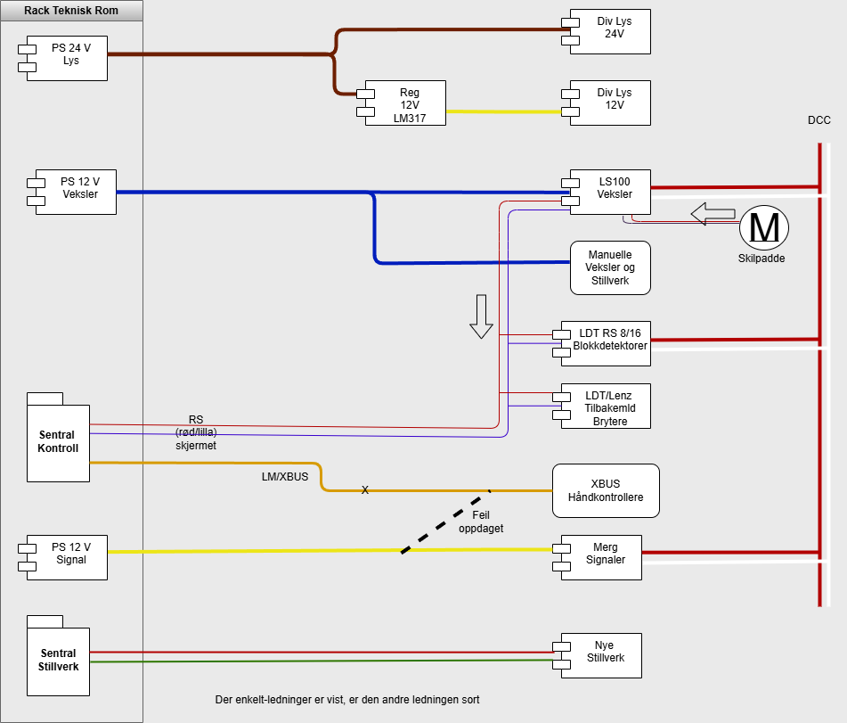

# System informasjon

## Standard – Fargekoder kabel

| Utført | Dato          | Utgave | Dokumentnr |
|--------|---------------|--------|------------|
| Jimmy  | 14. april 2004 | 1.5    |            |

| Godkjent | Dato                   | Kontr. | Ref. |
|----------|------------------------|--------|------|
|          | 6. februar 2025 5. september 2025 |        |      |

---

| Funksjon                  | + (Pluss) / Kabel        | – (Minus / 0V) | Kommentar              |
|----------------------------|--------------------------|----------------|------------------------|
| Boosterstrøm               | Rød +                   | Sort 0V        |                        |
| 5V dc                      | Grønn +                 | Sort 0V        |                        |
| Motorstrøm 10 V dc         | Blå +                   | Sort 0V        |                        |
| 12V dc lys                 | Gul +                   | Sort 0V        |                        |
| Håndkontrollere 12V + Tilbakemelding | Orange + | Sort 0V        |                        |
| 24V dc lys                 | Brun +                  | Sort 0V        |                        |
| 16V ac                     | Grå                      | Sort           |                        |
| DCC                        | Rød mot front Hvit mot vegg |          | J på booster K på booster |
| DCC 2 Stillverk            | Rød mot front Grønn mot vegg |        | J på booster K på booster |
| Motorstyring               | Gul Rosa             |                | Revolveres 8 1   |
| Tilbakemelding veklser     | Hvit Lilla           |                | Revolveres 6 7   |
| Fjernstyringstillatelse veklser | Grå Hvit        |                | Revolveres             |
| Booster kontroller         | Grønn Hvit           |                | C D                 |
| RS buss                    | Skjermet parkabel (mikrofonkabel) |       | R: rød S: lilla/hvit |
| Håndkontrollerbuss         | Skjermet parkabel (mikrofonkabel) |       | A: rød B: lilla/hvit |
| DCC Brems                  | Oransje mot front Grønn mot vegg |     | J på booster K på booster |
| Vendelsløyfe               | Oransje kabel           |                |                        |

## Systemskisse

